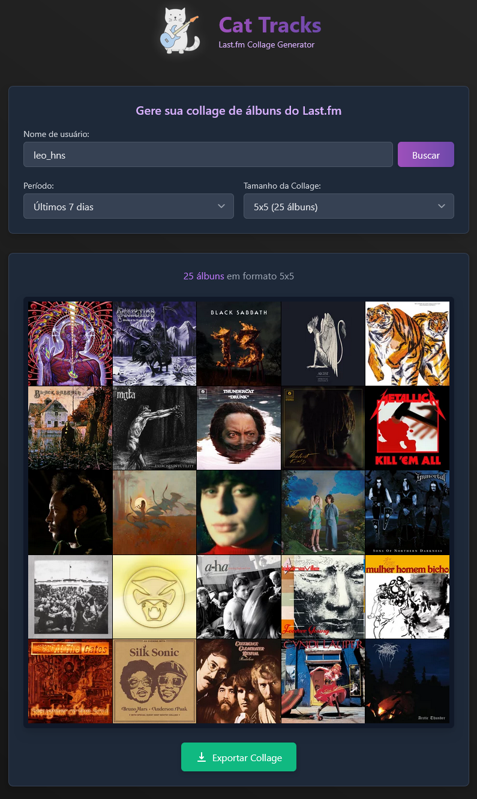

# Cat Tracks - Last.fm Collage Generator

Um gerador de collages elegante para seus álbuns mais escutados no Last.fm, com design moderno e interface intuitiva.

## 📸 Demo
https://cat-tracks.vercel.app/

## 🚀 Funcionalidades

- Geração de Collages: Crie collages com suas estatísticas do Last.fm
- Múltiplos Tamanhos: Opções de grade 3x3, 4x4, 5x5 e 10x10
- Períodos Flexíveis: Visualize seus álbuns em diferentes períodos de tempo
- Exportação em Alta Qualidade: Salve suas collages em formato WEBP
- Design Responsivo: Funciona em desktop e dispositivos móveis

## 🛠️ Tecnologias Utilizadas

- React
- TypeScript
- Tailwind CSS
- Vite
- React Router
- Last.fm API

